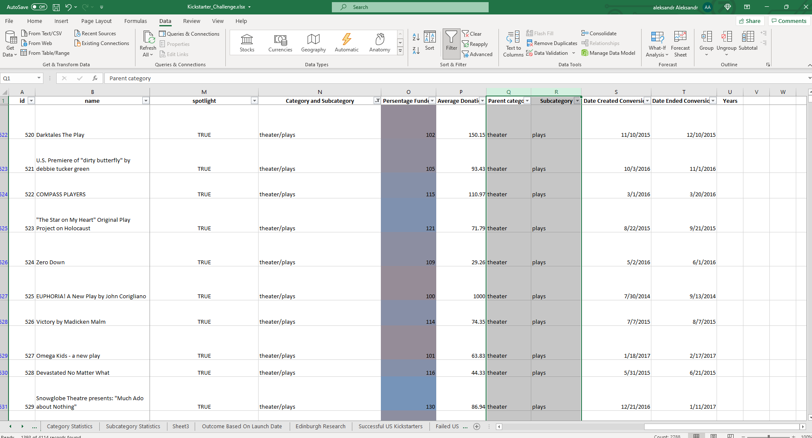
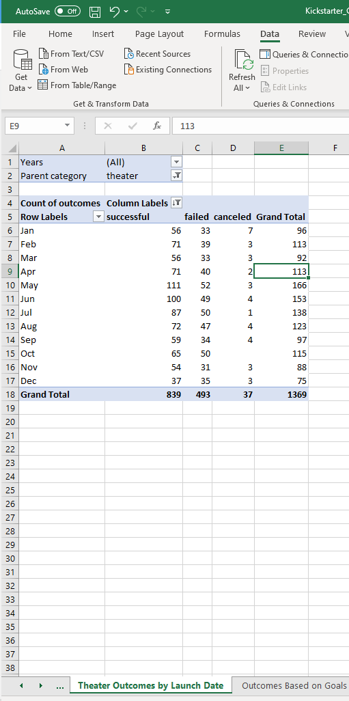
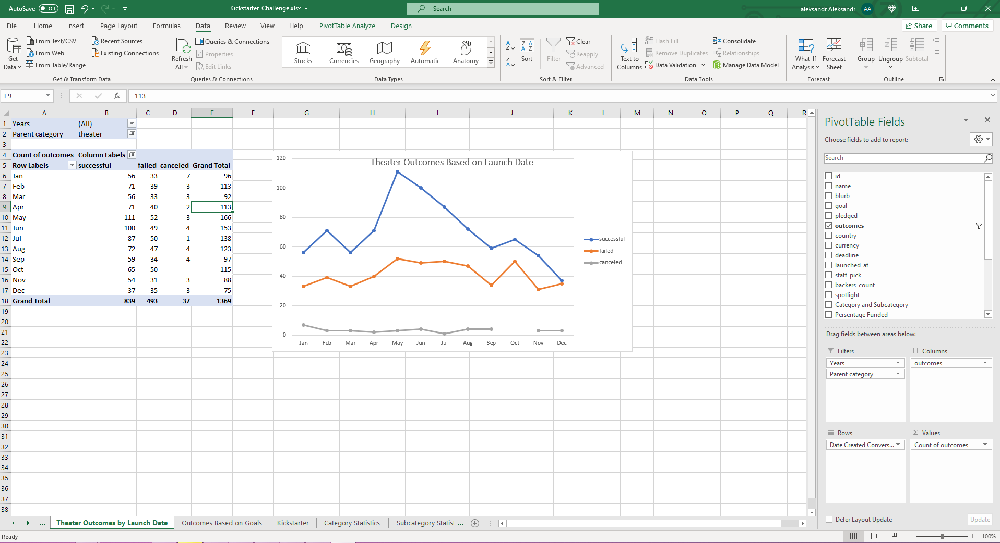
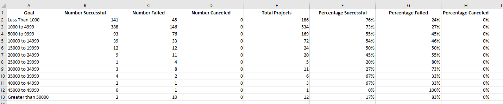
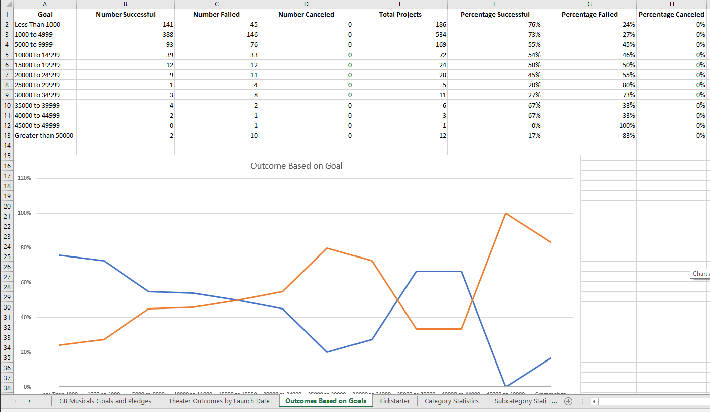

# An Analysis of Kickstarter Campaigns
Performing analysis on Kickstarter data to uncover trends

---

I would recommend Louise to set up a $3000 (which is median among successful US Kickstarters) to $4018 (Upper qartile of Pledged amount for US plays) goal for her play fundraising campaign and start it in May-July, when the most successful campaigns were started. 

For her future musical project I would suggest a $1496 goal (which is right on upper quartile line of all Kickstarters musical pledges in GB)

# Kickstarting with Excel

## Overview of Project

This project shows capability of Excel to help analyzing small data and it's applicability across all areas of life: from household budgeting to complex financial analysis. Features such as formulas, charts,pivot tables, filters, formatting etc. help read, organize and understand data, answer data-related questions as well as uncover trends and patterns.

### Purpose

The project is created to help Louise to make a weighted decision regarding her crowdfunding campaign to help fund her play Fever, determine whether there are specific factors that make a project campaign successful.

## Analysis and Challenges

### Analysis of Outcomes Based on Launch Date

To analyze outcomes based on launch date I

1. Split a column named Category and Subcategory into two columns: Parent Category and Subcategory using Text to Columns feature

   

2. Created a pivot table with Date Created rows and Outcomes columns that counts outcomes (successful, failed and canceled) based on the date of the campaign's creation with filters Years and Parent Category

   

3. Created a chart based on the pivot table

   

4. This chart allows us to see  outcomes of different campaigns based on their launch date. We can switch categories using filters. If we check theatre, we can see that the most successful campaigns were lunched in May, June and July. At the same time May, June, July, August and October show the highest number of failed campaigns.

### Analysis of Outcomes Based on Goals

To analyze outcomes based on goals I

1. Created a table to find number and percentage of successful, failed and canceled campaigns depending on their goal amount with $4999 step.

2. Calculated numbers of successful, failed and canceled programs using function COUNTIFS()

3. Calculated total amount of projects depending on their goal amount by adding numbers of successful, failed and canceled campaigns

4. Calculated percentage of successful, failed and canceled programs by dividing given number by  total amount. Chose Percentage data type in cells that show percentage and adjusted decimal to 0. 

   Alternatively I could use ROUND() function to find percentage.

   

5. Created a chart showing percentage of successful, failed and canceled programs based on their goal amount.

   

### Challenges and Difficulties Encountered

I did not encountered any challenges during completing this project but here are some issues that possibly might be met:

- Errors. It might be a typo, that can be fixed by checking and correcting to formula or a function error like # DIV/0. In this case function IFERROR() is used to explain EXCEL what value we want to be placed instead of an error message.
- Wrong data format chosen. In this case we have to check all data that is used in particular formula and make sure that data type is appropriate
- Wrong chart type is chosen. Some charts better describe one information while others are more effective for another one. Knowing what chart displays needed information better might significantly help reading the results
- Not understanding clearly what we are looking for and what data can help with this query and if it needs to be transformed (for instance, split). In this case helps analyzing the data and realizing the goals can help. And practice, lots of practice :)

## Results

- What are two conclusions you can draw about the Outcomes based on Launch Date?

  1. The most effective campaigns overall are launched in May, June and February
  2. At the same time in February is one of the lowest amount of failed and canceled campaigns. May is good too while June, July, January and October are pretty risky for campaigns to fail.

- What can you conclude about the Outcomes based on Goals?

  The most successful campaigns had a goal either from less than $1000 to $4999 or  from $25000 to $44999.

- What are some limitations of this dataset?

   Although campaigns with a goal from $25000 to $44999 show pretty decent percentage of success (67%)  there were too few examples to make any conclusion if this goal amount connected to success of the campaign or not. 

- What are some other possible tables and/or graphs that we could create?

  We could also analyze successful, failed of cancelled campaigns based on average donation and backers count by creating a table with Average Donation  ($5 step) or Backers  (5 people step) instead of Goal column and create a line chart based on this data.

