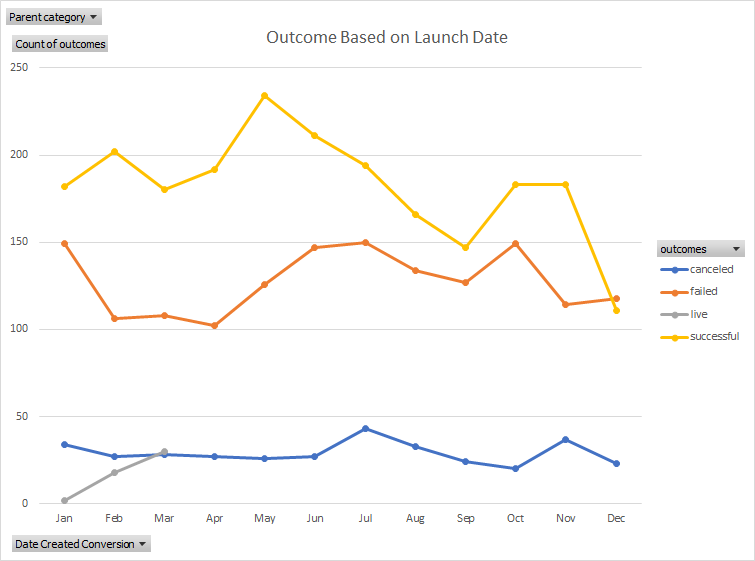
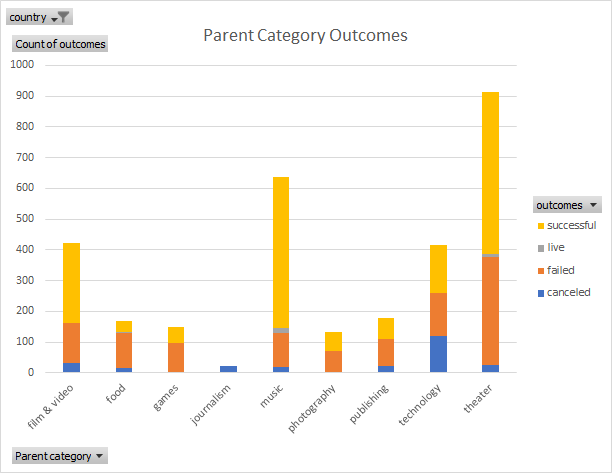
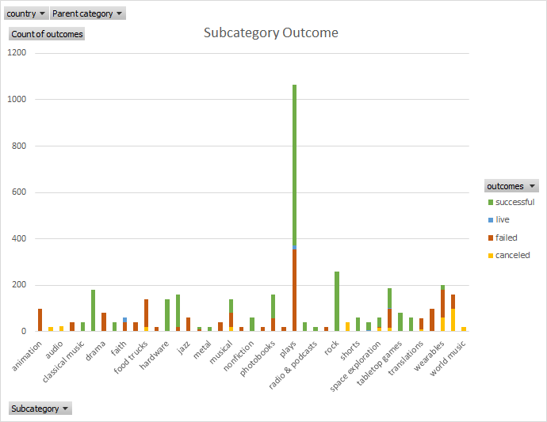
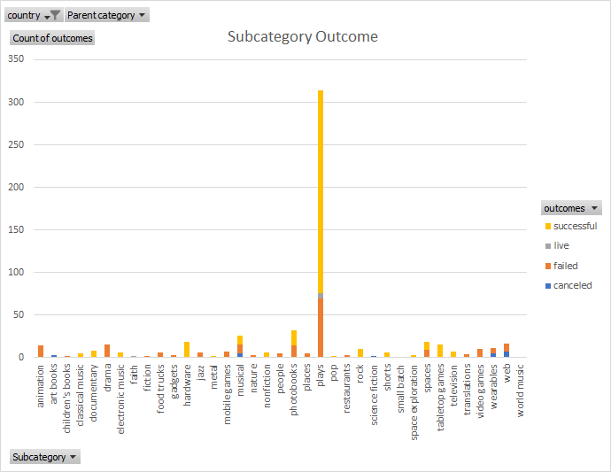

# An Analysis of Kickstarter Campains
Performing analysis on Kickstarter data to uncover trends

---

I would recommend Louise to set up a $3000 (which is median among successful Us Kickstarters) goal for her play fundraising campain and start it in May-July, when the most successful campains were started. 

For her future musical project I would suggest a $1496 goal (which is right on upper quartile line of all Kickstarters musical pledges in GB)

